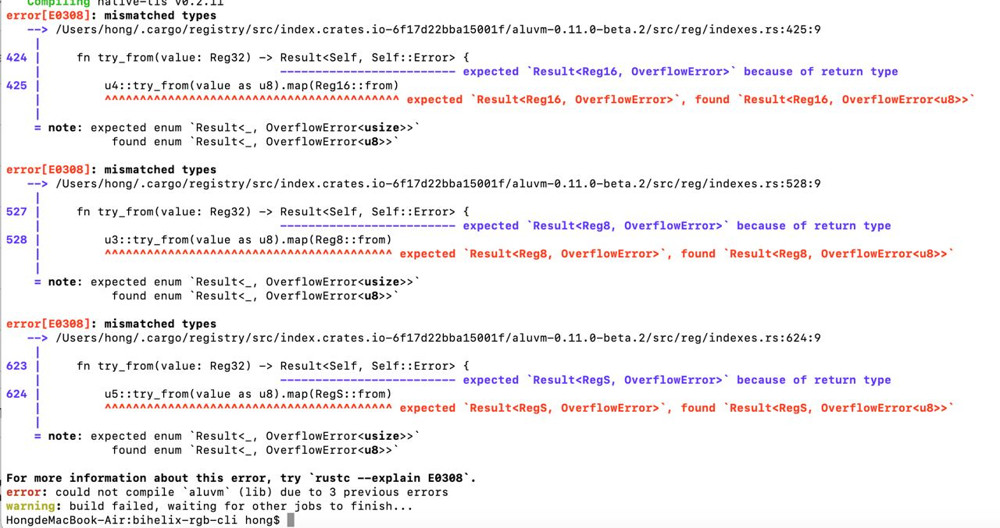

# BiHelix RGB CLI
Introducing the revolutionary RGB command-line tool, meticulously crafted by the BiHelix Team. Leveraging the power of the Bitcoin Development Kit and the latest rgb v0.11 libraries, this tool empowers users to seamlessly import, export, issue, and inquire about their off-chain RGB20 assets. 

**Please note, at this stage, users can import and inquire about their rgb20 assets using this cutting-edge CLI tool, with forthcoming support for more asset categories transfer. Stay tuned as we continue to innovate and elevate the Bitcoin blockchain experience.**

# Requirements
Before run this repo, please check whether or not your rust version satisfy 1.76, if not, please update it to the 1.76 version(Or the latest stable version).

# Installation
Clone the repo from the github and compile it.
```bash
git clone https://github.com/bihelix-io/bihelix-rgb-cli
cd bihelix-rgb-cli
cargo build --release
cd ./target/release
```

# Notes
## amplify_num bugs

If anyone meet this error, please run 
`sudo cargo update amplify_num --precise 0.5.1`
then, run 
`sudo cargo build --release` 
again

# Usage
## Prepare the data
- Get the RGB20 token **contract id**
- Create **./data/bitcoin** directory if not exists
- Copy **stock.dat** file into ./data/bitcoin directory

## Query the RGB20 asset
Open PowerShell(Windows) or Terminal(MacOS) and types cmd as followed.
```bash
./bihelix-rgb-cli -n bitcoin rgb -d ./data state [contract id] RGB20 --address [your bitcoin address]
```

./bihelix-rgb-cli -n bitcoin rgb -d ./data state <contract id> RGB20 --address <your bitcoin address>
```
