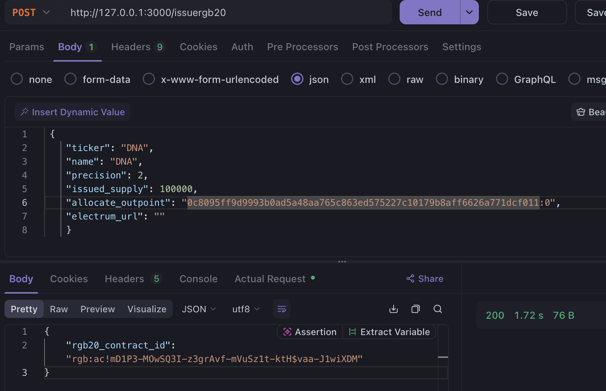

<!--
 * @Author: jack cymqqqq@gmail.com
 * @Date: 2025-02-25 10:38:23
 * @LastEditors: jack cymqqqq@gmail.com
 * @LastEditTime: 2025-02-26 09:23:06
 * @FilePath: /bihelix-rgb-cli/README.md
 * @Description: 这是默认设置,请设置`customMade`, 打开koroFileHeader查看配置 进行设置: https://github.com/OBKoro1/koro1FileHeader/wiki/%E9%85%8D%E7%BD%AE
-->

# BiHelix RGB CLI
Introducing the revolutionary RGB service, meticulously crafted by the BiHelix Team. Leveraging the power of the Bitcoin Development Kit and the latest rgb v0.11 libraries, this service empowers users or learners to seamlessly to learn how to issue, and transfer about their off-chain RGB assets. 

# Features
Simple KV based database, rocksdb is supported here.

# Notes
Now the developer can use this service to perform rgb asset with, `issue rgb20 asset`.
The `transfer asset`, and `query asset` operations will supported soon.

# Requirements
Before run this repo, please check whether or not your `rust` version satisfy `1.78`, if not, please update it to the `1.78` version(Or the latest stable version).

# Installation
Clone the repo from the github and compile it.
```bash
git clone https://github.com/bihelix-io/bihelix-rgb-cli
cd bihelix-rgb-cli
cargo run
```

# Usage
## Startup the service in a command line, if the service can successfully run, then you can see:
```bash
generate wallet done
Server running at http://0.0.0.0:3000
```
## Then, open a new command line(If you use the APiFox or Postman, you can directly run it).
# Output
```bash
{
    "ticker": "DNA",
    "name": "DNA",
    "precision": 2,
    "issued_supply": 100000,
    "allocate_outpoint": "0c8095ff9d9993b0ad5a48aa765c863ed575227c10179b8aff6626a771dcf011:0",
    "electrum_url": "blackie.c3-soft.com:57009"
    }

  {
    "rgb20_contract_id": "rgb:ac!mD1P3-MOwSQ3I-z3grAvf-mVuSz1t-ktH$vaa-J1wiXDM"
}
```


## Issue of RGB20 Asset with APIFOX(you should find a bitcoin testnet4 electrum url)
